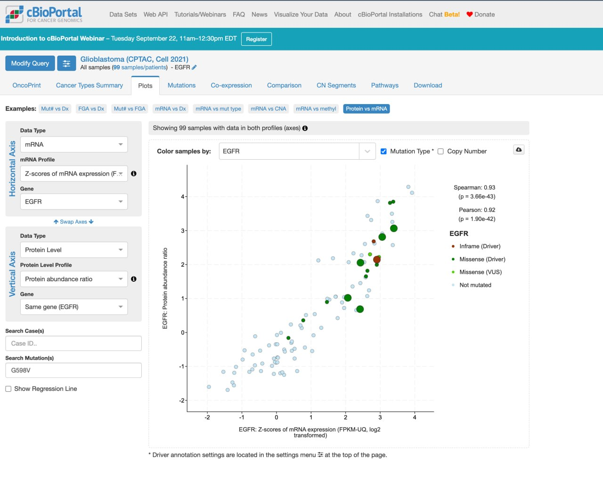
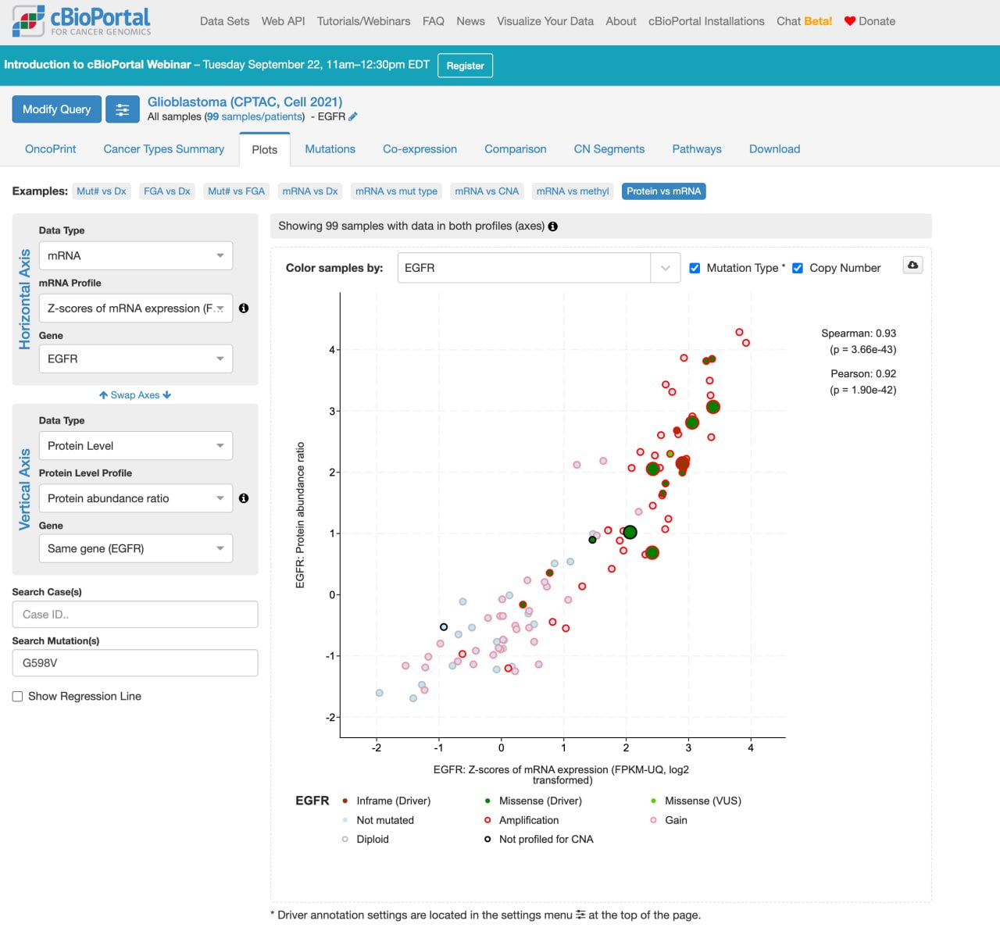
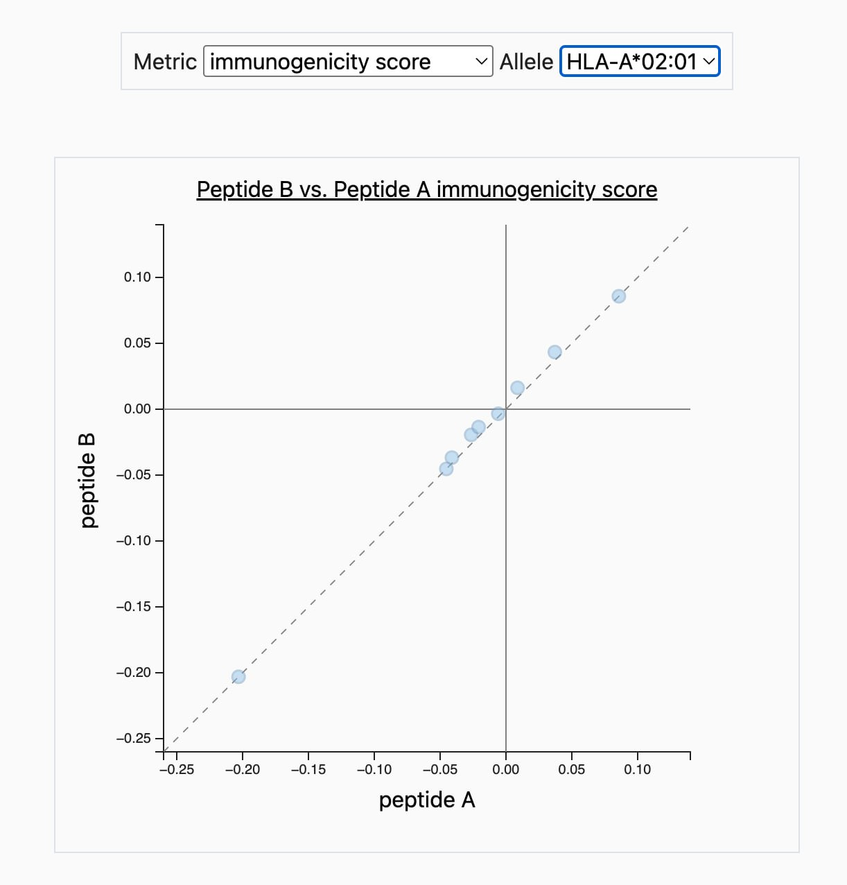
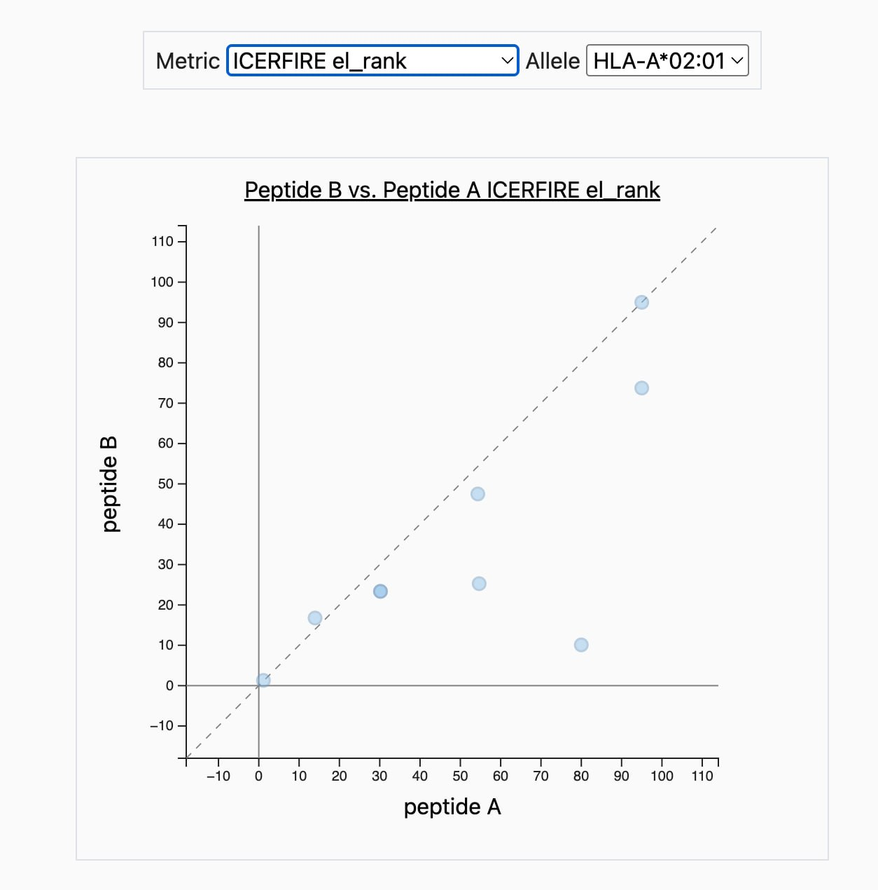

# EGFR G598V in Glioblastoma

An immunology course exercise on EGFR G598V in glioblastoma, worked end to end: protein
sequence, antigen processing and presentation, expression integration, structural
immunogenicity, and what a public neo-antigen atlas can and cannot validate.

The write-up below is the assignment itself. The same document is available as
[docs/assignment.pdf](docs/assignment.pdf), 14 pages, and as a self-contained
[docs/assignment.html](docs/assignment.html). Every table is generated from the raw tool
output in `results/` by [scripts/04_build_assignment.py](scripts/04_build_assignment.py).

---

From protein sequence and antigen processing to expression, immunogenicity, and the limits of
database validation.

This analysis evaluates a single EGFR substitution using HLA-A\*02:01 as a representative common class I allele. Scores describe computational predictions; expression measurements are gene-level observations. Neither establishes that a mutant peptide is naturally presented or recognized by T cells.

## Step 1. Generate Neoantigen and Native Antigen Sequences

The selected alteration is EGFR p.Gly598Val (G598V) in glioblastoma. The supplied protein FASTA records identify transcript `ENST00000275493` and contain 1,210 amino acids each. Direct comparison finds exactly one difference: glycine in the wild type is replaced by valine at residue 598, using one-based numbering of the full precursor protein.

**Sequence provenance and VEP limitation.** The sequences below come directly from `data/egfr_wt.fa` and `data/egfr_g598v.fa`. No VEP web screenshot, input genomic variant, genome assembly, transcript version, or VEP result export is retained in the repository. Therefore, a completed VEP web annotation cannot be documented here. The protein substitution is verified from the supplied files, not represented as a newly observed VEP result.

Sequence context, residues 586 to 610, with the substituted position marked:

```
                    598
                     |
WT     IDGPHCVKTCPA  G  VMGENNTLVWKY
G598V  IDGPHCVKTCPA  V  VMGENNTLVWKY
```

### Wild-type protein

```
>EGFR_WT_ENST00000275493_1210aa
MRPSGTAGAALLALLAALCPASRALEEKKVCQGTSNKLTQLGTFEDHFLSLQRMFNNCEV
VLGNLEITYVQRNYDLSFLKTIQEVAGYVLIALNTVERIPLENLQIIRGNMYYENSYALA
VLSNYDANKTGLKELPMRNLQEILHGAVRFSNNPALCNVESIQWRDIVSSDFLSNMSMDF
QNHLGSCQKCDPSCPNGSCWGAGEENCQKLTKIICAQQCSGRCRGKSPSDCCHNQCAAGC
TGPRESDCLVCRKFRDEATCKDTCPPLMLYNPTTYQMDVNPEGKYSFGATCVKKCPRNYV
VTDHGSCVRACGADSYEMEEDGVRKCKKCEGPCRKVCNGIGIGEFKDSLSINATNIKHFK
NCTSISGDLHILPVAFRGDSFTHTPPLDPQELDILKTVKEITGFLLIQAWPENRTDLHAF
ENLEIIRGRTKQHGQFSLAVVSLNITSLGLRSLKEISDGDVIISGNKNLCYANTINWKKL
FGTSGQKTKIISNRGENSCKATGQVCHALCSPEGCWGPEPRDCVSCRNVSRGRECVDKCN
LLEGEPREFVENSECIQCHPECLPQAMNITCTGRGPDNCIQCAHYIDGPHCVKTCPAGVM
GENNTLVWKYADAGHVCHLCHPNCTYGCTGPGLEGCPTNGPKIPSIATGMVGALLLLLVV
ALGIGLFMRRRHIVRKRTLRRLLQERELVEPLTPSGEAPNQALLRILKETEFKKIKVLGS
GAFGTVYKGLWIPEGEKVKIPVAIKELREATSPKANKEILDEAYVMASVDNPHVCRLLGI
CLTSTVQLITQLMPFGCLLDYVREHKDNIGSQYLLNWCVQIAKGMNYLEDRRLVHRDLAA
RNVLVKTPQHVKITDFGLAKLLGAEEKEYHAEGGKVPIKWMALESILHRIYTHQSDVWSY
GVTVWELMTFGSKPYDGIPASEISSILEKGERLPQPPICTIDVYMIMVKCWMIDADSRPK
FRELIIEFSKMARDPQRYLVIQGDERMHLPSPTDSNFYRALMDEEDMDDVVDADEYLIPQ
QGFFSSPSTSRTPLLSSLSATSNNSTVACIDRNGLQSCPIKEDSFLQRYSSDPTGALTED
SIDDTFLPVPEYINQSVPKRPAGSVQNPVYHNQPLNPAPSRDPHYQDPHSTAVGNPEYLN
TVQPTCVNSTFDSPAHWAQKGSHQISLDNPDYQQDFFPKEAKPNGIFKGSTAENAEYLRV
APQSSEFIGA
```

### G598V protein

```
>EGFR_G598V_ENST00000275493_1210aa
MRPSGTAGAALLALLAALCPASRALEEKKVCQGTSNKLTQLGTFEDHFLSLQRMFNNCEV
VLGNLEITYVQRNYDLSFLKTIQEVAGYVLIALNTVERIPLENLQIIRGNMYYENSYALA
VLSNYDANKTGLKELPMRNLQEILHGAVRFSNNPALCNVESIQWRDIVSSDFLSNMSMDF
QNHLGSCQKCDPSCPNGSCWGAGEENCQKLTKIICAQQCSGRCRGKSPSDCCHNQCAAGC
TGPRESDCLVCRKFRDEATCKDTCPPLMLYNPTTYQMDVNPEGKYSFGATCVKKCPRNYV
VTDHGSCVRACGADSYEMEEDGVRKCKKCEGPCRKVCNGIGIGEFKDSLSINATNIKHFK
NCTSISGDLHILPVAFRGDSFTHTPPLDPQELDILKTVKEITGFLLIQAWPENRTDLHAF
ENLEIIRGRTKQHGQFSLAVVSLNITSLGLRSLKEISDGDVIISGNKNLCYANTINWKKL
FGTSGQKTKIISNRGENSCKATGQVCHALCSPEGCWGPEPRDCVSCRNVSRGRECVDKCN
LLEGEPREFVENSECIQCHPECLPQAMNITCTGRGPDNCIQCAHYIDGPHCVKTCPAVVM
GENNTLVWKYADAGHVCHLCHPNCTYGCTGPGLEGCPTNGPKIPSIATGMVGALLLLLVV
ALGIGLFMRRRHIVRKRTLRRLLQERELVEPLTPSGEAPNQALLRILKETEFKKIKVLGS
GAFGTVYKGLWIPEGEKVKIPVAIKELREATSPKANKEILDEAYVMASVDNPHVCRLLGI
CLTSTVQLITQLMPFGCLLDYVREHKDNIGSQYLLNWCVQIAKGMNYLEDRRLVHRDLAA
RNVLVKTPQHVKITDFGLAKLLGAEEKEYHAEGGKVPIKWMALESILHRIYTHQSDVWSY
GVTVWELMTFGSKPYDGIPASEISSILEKGERLPQPPICTIDVYMIMVKCWMIDADSRPK
FRELIIEFSKMARDPQRYLVIQGDERMHLPSPTDSNFYRALMDEEDMDDVVDADEYLIPQ
QGFFSSPSTSRTPLLSSLSATSNNSTVACIDRNGLQSCPIKEDSFLQRYSSDPTGALTED
SIDDTFLPVPEYINQSVPKRPAGSVQNPVYHNQPLNPAPSRDPHYQDPHSTAVGNPEYLN
TVQPTCVNSTFDSPAHWAQKGSHQISLDNPDYQQDFFPKEAKPNGIFKGSTAENAEYLRV
APQSSEFIGA
```

Residue 598 is the tenth line, position 58. GitHub does not render colour inside a code block, so the residue is marked in red in [docs/assignment.pdf](docs/assignment.pdf) and [docs/assignment.html](docs/assignment.html) instead. Lines contain at most 60 residues; the wrapping does not alter the sequence.

## Step 2. Intracellular Processing and MHC Class I Binding

The archived IEDB T Cell Prediction Class I results use HLA-A\*02:01 and NetMHCpan 4.1 BA together with MHC-I Processing. The original run notes specify Basic Processing Predictions and the immunoproteasome option; the peptide CSVs establish the allele, peptide length, and output columns but do not independently record that proteasome setting. Sequence 1 is wild type and sequence 2 is G598V. Each full-length protein yields 1,202 nine-residue windows or 1,198 thirteen-residue windows.

Tables are sorted by decreasing `processing total score`, as requested. In these exports, total = proteasome + TAP + MHC, whereas `processing score` alone = proteasome + TAP. MHC score = −log10(predicted IC50 in nM). Higher scores and lower IC50 values are favorable, but these are not calibrated probabilities of cleavage, transport, or presentation. See [IEDB score definitions](https://tools.iedb.org/processing/help/).

### Top ten 9-mers from each protein

Wild type: 9-mers ranked by processing total score

| Rank | Peptide | Start | Proteasome | TAP | MHC | Total | IC50 (nM) |
| --- | --- | --- | --- | --- | --- | --- | --- |
| 1 | YLLNWCVQI | 813 | 1.369 | 0.218 | -0.601 | 0.986 | 3.99 |
| 2 | ALLALLAAL | 10 | 1.380 | 0.563 | -1.024 | 0.919 | 10.57 |
| 3 | GMVGALLLL | 649 | 1.325 | 0.429 | -1.231 | 0.523 | 17.03 |
| 4 | QLMPFGCLL | 791 | 1.398 | 0.463 | -1.365 | 0.497 | 23.15 |
| 5 | SQYLLNWCV | 811 | 1.255 | 0.259 | -1.332 | 0.181 | 21.49 |
| 6 | RMFNNCEVV | 53 | 1.127 | 0.321 | -1.342 | 0.107 | 21.98 |
| 7 | LLLLLVVAL | 654 | 1.821 | 0.502 | -2.233 | 0.090 | 171.14 |
| 8 | YQDPHSTAV | 1125 | 1.018 | 0.073 | -1.300 | -0.209 | 19.97 |
| 9 | YVLIALNTV | 88 | 1.064 | 0.182 | -1.516 | -0.271 | 32.84 |
| 10 | ALLAALCPA | 13 | 0.739 | -0.131 | -0.926 | -0.318 | 8.43 |

G598V: 9-mers ranked by processing total score

| Rank | Peptide | Start | Proteasome | TAP | MHC | Total | IC50 (nM) |
| --- | --- | --- | --- | --- | --- | --- | --- |
| 1 | YLLNWCVQI | 813 | 1.369 | 0.218 | -0.601 | 0.986 | 3.99 |
| 2 | ALLALLAAL | 10 | 1.380 | 0.563 | -1.024 | 0.919 | 10.57 |
| 3 | GMVGALLLL | 649 | 1.325 | 0.429 | -1.231 | 0.523 | 17.03 |
| 4 | QLMPFGCLL | 791 | 1.398 | 0.463 | -1.365 | 0.497 | 23.15 |
| 5 | SQYLLNWCV | 811 | 1.255 | 0.259 | -1.332 | 0.181 | 21.49 |
| 6 | RMFNNCEVV | 53 | 1.127 | 0.321 | -1.342 | 0.107 | 21.98 |
| 7 | LLLLLVVAL | 654 | 1.821 | 0.502 | -2.233 | 0.090 | 171.14 |
| 8 | YQDPHSTAV | 1125 | 1.018 | 0.073 | -1.300 | -0.209 | 19.97 |
| 9 | YVLIALNTV | 88 | 1.064 | 0.182 | -1.516 | -0.271 | 32.84 |
| 10 | ALLAALCPA | 13 | 0.739 | -0.131 | -0.926 | -0.318 | 8.43 |

Data: [results/iedb\_9mer/peptide\_table.csv](results/iedb_9mer/peptide_table.csv).

### Top ten 13-mers from each protein

Wild type: 13-mers ranked by processing total score

| Rank | Peptide | Start | Proteasome | TAP | MHC | Total | IC50 (nM) |
| --- | --- | --- | --- | --- | --- | --- | --- |
| 1 | FLSNMSMDFQNHL | 172 | 1.584 | 0.322 | -1.150 | 0.757 | 14.12 |
| 2 | RLLGICLTSTVQL | 776 | 1.598 | 0.536 | -2.109 | 0.025 | 128.45 |
| 3 | FLSLQRMFNNCEV | 48 | 1.082 | 0.091 | -1.559 | -0.386 | 36.24 |
| 4 | ALLAALCPASRAL | 13 | 1.419 | 0.517 | -2.454 | -0.519 | 284.47 |
| 5 | RMFNNCEVVLGNL | 53 | 1.450 | 0.603 | -2.697 | -0.644 | 497.21 |
| 6 | QLITQLMPFGCLL | 787 | 1.398 | 0.481 | -2.687 | -0.808 | 486.79 |
| 7 | SIATGMVGALLLL | 645 | 1.325 | 0.439 | -2.575 | -0.810 | 375.71 |
| 8 | TAGAALLALLAAL | 6 | 1.380 | 0.346 | -2.587 | -0.861 | 386.62 |
| 9 | VLIALNTVERIPL | 89 | 1.221 | 0.460 | -2.593 | -0.912 | 391.95 |
| 10 | QLMPFGCLLDYVR | 791 | 1.247 | 0.690 | -2.873 | -0.936 | 747.28 |

G598V: 13-mers ranked by processing total score

| Rank | Peptide | Start | Proteasome | TAP | MHC | Total | IC50 (nM) |
| --- | --- | --- | --- | --- | --- | --- | --- |
| 1 | FLSNMSMDFQNHL | 172 | 1.584 | 0.322 | -1.150 | 0.757 | 14.12 |
| 2 | RLLGICLTSTVQL | 776 | 1.598 | 0.536 | -2.109 | 0.025 | 128.45 |
| 3 | FLSLQRMFNNCEV | 48 | 1.082 | 0.091 | -1.559 | -0.386 | 36.24 |
| 4 | ALLAALCPASRAL | 13 | 1.419 | 0.517 | -2.454 | -0.519 | 284.47 |
| 5 | RMFNNCEVVLGNL | 53 | 1.450 | 0.603 | -2.697 | -0.644 | 497.21 |
| 6 | QLITQLMPFGCLL | 787 | 1.398 | 0.481 | -2.687 | -0.808 | 486.79 |
| 7 | SIATGMVGALLLL | 645 | 1.325 | 0.439 | -2.575 | -0.810 | 375.71 |
| 8 | TAGAALLALLAAL | 6 | 1.380 | 0.346 | -2.587 | -0.861 | 386.62 |
| 9 | VLIALNTVERIPL | 89 | 1.221 | 0.460 | -2.593 | -0.912 | 391.95 |
| 10 | QLMPFGCLLDYVR | 791 | 1.247 | 0.690 | -2.873 | -0.936 | 747.28 |

Data: [results/iedb\_13mer/peptide\_table.csv](results/iedb_13mer/peptide_table.csv).

The top ten sequences and their scores are identical between wild type and G598V at each length. None spans residue 598. They are high-scoring EGFR peptides, not mutation-specific neoantigen candidates.

### Windows spanning the mutation

Ranks below are ordinal positions within each protein and peptide length, calculated from unrounded totals. They are not percentile ranks. Displayed deltas are calculated before rounding.

Mutation-containing 9-mers

| Window | WT peptide | WT rank | WT total | Mutant peptide | Mutant rank | Mutant total | Δ total |
| --- | --- | --- | --- | --- | --- | --- | --- |
| 590–598 | HCVKTCPAG | 1028 | -4.412 | HCVKTCPAV | 280 | -2.824 | +1.588 |
| 591–599 | CVKTCPAGV | 189 | -2.474 | CVKTCPAVV | 210 | -2.543 | -0.069 |
| 592–600 | VKTCPAGVM | 439 | -3.285 | VKTCPAVVM | 351 | -3.006 | +0.279 |
| 593–601 | KTCPAGVMG | 757 | -3.928 | KTCPAVVMG | 718 | -3.838 | +0.090 |
| 594–602 | TCPAGVMGE | 988 | -4.351 | TCPAVVMGE | 974 | -4.318 | +0.033 |
| 595–603 | CPAGVMGEN | 924 | -4.234 | CPAVVMGEN | 951 | -4.286 | -0.052 |
| 596–604 | PAGVMGENN | 1097 | -4.546 | PAVVMGENN | 1041 | -4.431 | +0.115 |
| 597–605 | AGVMGENNT | 918 | -4.221 | AVVMGENNT | 752 | -3.910 | +0.311 |
| 598–606 | GVMGENNTL | 34 | -1.168 | VVMGENNTL | 33 | -1.142 | +0.026 |

Mutation-containing 13-mers

| Window | WT peptide | WT rank | WT total | Mutant peptide | Mutant rank | Mutant total | Δ total |
| --- | --- | --- | --- | --- | --- | --- | --- |
| 586–598 | IDGPHCVKTCPAG | 1120 | -4.622 | IDGPHCVKTCPAV | 510 | -3.466 | +1.156 |
| 587–599 | DGPHCVKTCPAGV | 581 | -3.584 | DGPHCVKTCPAVV | 484 | -3.410 | +0.174 |
| 588–600 | GPHCVKTCPAGVM | 573 | -3.574 | GPHCVKTCPAVVM | 454 | -3.331 | +0.244 |
| 589–601 | PHCVKTCPAGVMG | 979 | -4.372 | PHCVKTCPAVVMG | 975 | -4.361 | +0.010 |
| 590–602 | HCVKTCPAGVMGE | 1038 | -4.468 | HCVKTCPAVVMGE | 1036 | -4.459 | +0.009 |
| 591–603 | CVKTCPAGVMGEN | 822 | -4.074 | CVKTCPAVVMGEN | 841 | -4.115 | -0.041 |
| 592–604 | VKTCPAGVMGENN | 910 | -4.241 | VKTCPAVVMGENN | 908 | -4.233 | +0.008 |
| 593–605 | KTCPAGVMGENNT | 811 | -4.051 | KTCPAVVMGENNT | 790 | -3.998 | +0.053 |
| 594–606 | TCPAGVMGENNTL | 149 | -2.330 | TCPAVVMGENNTL | 144 | -2.318 | +0.012 |
| 595–607 | CPAGVMGENNTLV | 372 | -3.132 | CPAVVMGENNTLV | 371 | -3.135 | -0.002 |
| 596–608 | PAGVMGENNTLVW | 297 | -2.860 | PAVVMGENNTLVW | 255 | -2.738 | +0.122 |
| 597–609 | AGVMGENNTLVWK | 475 | -3.393 | AVVMGENNTLVWK | 398 | -3.187 | +0.206 |
| 598–610 | GVMGENNTLVWKY | 22 | -1.323 | VVMGENNTLVWKY | 19 | -1.216 | +0.107 |

The largest total-score increase occurs when G598V is the C-terminal residue: HCVKTCPAG → HCVKTCPAV at nine residues, and IDGPHCVKTCPAG → IDGPHCVKTCPAV at thirteen. A valine side chain is more compatible with a hydrophobic HLA-A\*02:01 C-terminal anchor than glycine, so improved binding is biologically plausible. This is a mechanistic interpretation, not a measured structure or affinity. The total-score improvement also contains processing effects:

Decomposition of the C-terminal G598V effect

| Length | Δ proteasome | Δ TAP | Δ MHC | Δ total | WT IC50 | Mutant IC50 |
| --- | --- | --- | --- | --- | --- | --- |
| 9 | +0.200683 | +0.740678 | +0.646541 | +1.587901 | 38124.12 | 8603.18 |
| 13 | +0.200683 | +0.740678 | +0.214771 | +1.156132 | 43096.20 | 26282.57 |

Even after improvement, these predicted affinities remain above 500 nM. None of the nine mutant 9-mers meets that affinity cutoff. VVMGENNTL has the highest processing total among the nine mutant windows, but its BA IC50 is 1,808.14 nM. Relative rank alone should not be called strong binding.

### Why do the 9-mer and 13-mer results differ?

Wild-type score distributions

| Column | 9-mer mean | 13-mer mean | 9-mer maximum | 13-mer maximum |
| --- | --- | --- | --- | --- |
| proteasome score | 1.016727 | 1.015808 | 1.836813 | 1.836813 |
| tap score | -0.105684 | -0.106447 | 1.399156 | 1.454860 |
| mhc score | -4.364713 | -4.403432 | -0.600973 | -1.149835 |
| processing total score | -3.453670 | -3.494071 | 0.985801 | 0.756650 |

The numbers of WT peptides with predicted IC50 < 500 nM are 31/1,202 and 11/1,198, respectively. The mean total decreases by 0.040401 for 13-mers; the MHC term accounts for 0.038719 of this difference. This arithmetic describes these two window sets, not a controlled experiment isolating length.

The proteasome score concerns the C-terminal cleavage site and its local protein context. Identical cleavage sites have identical proteasome scores in these runs. TAP scoring emphasizes terminal sequence and potential N-terminal precursors, so changing the window can change its score even when the C terminus is fixed. Similar whole-protein means do not demonstrate biological independence from length. For example, the WT windows ending at 598 have TAP scores of −0.665889 at nine residues and −0.822274 at thirteen. The terminal-sequence approximation is described by [Peters et al. (2003)](https://tools.iedb.org/static/pdf/peters_2003_joi.pdf).

Class I grooves commonly accommodate short peptides; longer ligands can use altered conformations, including central bulging. This gives a plausible context for the weaker binding-score tail here, but neither a universally flat 9-mer nor a fixed energetic penalty for every 13-mer can be inferred. [Structural studies of peptide length](https://pmc.ncbi.nlm.nih.gov/articles/PMC3653566/) demonstrate the importance of peptide conformation.

Only one HLA allele and two lengths were examined. Scores omit patient-specific antigen abundance and much of cellular processing, including variable trimming and degradation. Top-ranked full-protein windows may also arise from regions handled differently during protein maturation. Absolute scores share a computational definition across runs but are not calibrated cross-length probabilities; ranks refer to different candidate sets.

## Step 3. Expression Integration

The representative cohort is [cBioPortal `gbm_cptac_2021`](https://www.cbioportal.org/study/summary?id=gbm_cptac_2021), Glioblastoma (CPTAC, Cell 2021), queried for EGFR (Entrez 1956). Protein abundance was measured by mass spectrometry. The retained screenshots show the Plots tab with Protein vs mRNA and G598V entered in Search Mutation(s). They contain 99 samples with both measurements.



*Figure 1. EGFR protein abundance versus log2-transformed mRNA z-score. Enlarged points identify G598V samples. The screenshot reports Pearson r = 0.92 and Spearman ρ = 0.93. These measurements represent total EGFR, not separate wild-type and mutant molecules.*



*Figure 2. The same expression comparison with copy-number annotation. Red outlines denote amplification; black outlines indicate missing CNA profiling. Five of the six G598V samples have amplification calls and one lacks a CNA call.*

### Expression in mutant-bearing versus non-mutated samples

The following statistics were recomputed from a fresh cBioPortal API snapshot archived for this audit. The original repository had no expression table. Group membership uses recorded EGFR mutations; “no mutation” means no mutation recorded in this profile, not proof of a completely wild-type tumor.

EGFR expression by mutation group

| Group | n | Protein median | mRNA median (profile units) |
| --- | --- | --- | --- |
| Any EGFR mutation | 17 | 2.055 | 8,019,677.8 |
| No recorded EGFR mutation | 82 | -0.098 | 527,697.9 |
| G598V | 6 | 2.101 | 7,980,513.1 |
| All samples without G598V | 93 | 0.137 | 733,153.5 |

Data: [results/expression\_audit/sample\_table.tsv](results/expression_audit/sample_table.tsv).

The six G598V tumors have higher gene-level mRNA and protein values than the 82 samples with no recorded EGFR mutation. The 93-sample “without G598V” group also includes other EGFR mutations and should not be equated with the non-mutated group. Protein values are the portal abundance-ratio profile, not absolute concentrations. The raw mRNA profile is described by cBioPortal as UQ-normalized FPKM, median-centered by gene; its numeric scale must not be interpreted as TPM or compared directly with ICERFIRE expression inputs.

Recalculated Pearson correlation is 0.817 for the raw mRNA profile and 0.925 for the archived log2-based mRNA z-score profile. The latter reproduces the displayed 0.92. Agreement across molecular levels supports a coherent association, but does not exclude shared technical or biological confounding.

Copy-number stratification (GISTIC ≥ 2 defines amplification)

| Group | n | Protein median |
| --- | --- | --- |
| Amplified, EGFR mutated | 15 | 2.146 |
| Amplified, no recorded EGFR mutation | 32 | 1.835 |
| Not amplified, no recorded EGFR mutation | 49 | -0.648 |

CNA is available for 96 samples; 47 are amplified. All 15 EGFR-mutated samples with CNA calls are amplified. The substantial expression contrast is confounded by amplification. These observational data do not establish that G598V increases expression or that amplification is the sole cause of the difference.

### Consequences for mass-spectrometry identification

High parent-protein abundance can improve the opportunity to detect EGFR peptides, but this gene-level measurement does not quantify mutant protein, mutant allele dosage, or HLA-bound antigen. Tumor purity, subclonality, allele-specific expression, peptide ionization, and sampling depth all affect recovery.

For a complete tryptic digest with no missed cleavages, the site-containing peptide is `TCPAGVMGENNTLVWK` in WT and `TCPAVVMGENNTLVWK` in G598V, residues 594 to 609. Missed cleavages or other proteases can yield additional site-containing peptides. Identification requires a variant-aware sequence search and supporting fragment ions. A reference-only search cannot directly assign the mutant sequence.

The G→V substitution adds C3H6, approximately 42.047 Da, the same elemental mass increment as trimethylation. Acetylation is approximately 42.011 Da and can be distinguishable by sufficiently accurate precursor mass. Modification site chemistry and site-localizing fragment ions remain essential. The mass increments are tabulated in [Unimod: trimethylation](https://www.unimod.org/modifications_view.php?editid1=37) and [Unimod: acetylation](https://www.unimod.org/modifications_view.php?editid1=1). Coexisting WT protein is possible, but its presence and abundance relative to mutant protein cannot be established from these gene-level profiles.

Bulk tryptic proteomics and HLA immunopeptidomics answer different questions. Detecting a mutant tryptic EGFR peptide would support translation of the variant; demonstrating presentation requires HLA isolation and identification of the naturally bound peptide, usually without tryptic digestion of that ligand pool.

## Step 4. Structural Immunogenicity

The input pairs are the nine mutation-spanning 9-mers from Step 2, with WT as peptide A and G598V as peptide B on the same input line. The global top-ten peptides are identical between proteins and therefore are not mutation-specific candidates. The retained Peptide Variant Comparison results include Class I pMHC Immunogenicity, Neo-Epitope Immunogenicity (ICERFIRE 1.0), and NetMHCpan 4.1 EL context for HLA-A\*02:01.

Paired peptide immunogenicity and ICERFIRE outputs

| Pair | Peptide A (WT) | Peptide B (G598V) | pMHC A | pMHC B | Δ pMHC | ICERFIRE prediction | ICERFIRE percentile |
| --- | --- | --- | --- | --- | --- | --- | --- |
| 1 | HCVKTCPAG | HCVKTCPAV | -0.20305 | -0.20305 | +0.00000 | 0.155003 | 55.97 |
| 2 | CVKTCPAGV | CVKTCPAVV | -0.04106 | -0.03674 | +0.00432 | 0.161927 | 50.75 |
| 3 | VKTCPAGVM | VKTCPAVVM | 0.03710 | 0.04334 | +0.00624 | 0.159644 | 52.45 |
| 4 | KTCPAGVMG | KTCPAVVMG | -0.02642 | -0.01946 | +0.00696 | 0.159644 | 52.45 |
| 5 | TCPAGVMGE | TCPAVVMGE | -0.02077 | -0.01357 | +0.00720 | 0.226528 | 15.86 |
| 6 | CPAGVMGEN | CPAVVMGEN | 0.00880 | 0.01624 | +0.00744 | 0.195180 | 29.14 |
| 7 | PAGVMGENN | PAVVMGENN | -0.00584 | -0.00344 | +0.00240 | 0.177093 | 40.00 |
| 8 | AGVMGENNT | AVVMGENNT | -0.04529 | -0.04529 | +0.00000 | 0.201125 | 26.11 |
| 9 | GVMGENNTL | VVMGENNTL | 0.08573 | 0.08573 | +0.00000 | 0.173724 | 42.28 |

Data: [results/iedb\_variant\_comparison/peptide\_table.csv](results/iedb_variant_comparison/peptide_table.csv).

Higher pMHC scores and ICERFIRE predictions are favorable; lower percentile ranks are favorable. The export contains one ICERFIRE immunogenicity prediction per WT/mutant pair, not separate WT and mutant ICERFIRE immunogenicity scores. It therefore cannot directly quantify a WT-to-mutant immunogenicity increase for that model.

Presentation ranks must be distinguished from final ICERFIRE ranks

| Pair | NetMHCpan 4.1 EL A | NetMHCpan 4.1 EL B | ICERFIRE internal EL A | ICERFIRE internal EL B | Mutant ICORE |
| --- | --- | --- | --- | --- | --- |
| 1 | 73 | 7.6 | 80 | 10.1 | HCVKTCPAV |
| 2 | 11 | 13 | 13.954 | 16.76 | CVKTCPAVV |
| 3 | 66 | 41 | 30.182 | 23.364 | KTCPAVVM |
| 4 | 31 | 26 | 30.182 | 23.364 | KTCPAVVM |
| 5 | 45 | 39 | 54.333 | 47.5 | TCPAVVMGE |
| 6 | 95 | 100 | 95 | 95 | CPAVVMGE |
| 7 | 100 | 100 | 95 | 73.75 | AVVMGENN |
| 8 | 46 | 20 | 54.667 | 25.268 | AVVMGENNT |
| 9 | 0.78 | 0.93 | 1.141 | 1.292 | VVMGENNTL |



*Figure 3. Peptide B versus peptide A pMHC immunogenicity score. Three pairs lie exactly on the identity line; six lie slightly above it. The small differences are visible in the numeric table even where they are difficult to resolve in the screenshot.*



*Figure 4. Peptide B versus peptide A ICERFIRE internal EL rank, as identified by the screenshot metric. This is not the final ICERFIRE immunogenicity percentile. Six pairs improve, two worsen, and one is unchanged; pairs 3 and 4 overlap. The largest improvement is 80 to 10.1.*

### Are the mutant peptides more immunogenic?

The pMHC model predicts six small positive differences (0.00240 to 0.00744) and three exact ties. These are real model differences, not rounding artifacts, but there is no uncertainty estimate or validated minimum difference here that establishes biological importance. The ties occur at mutation positions P9, P2, and P1, which are excluded by the default mask. A masked residue contributes nothing to this calculation; this does not prove that it is inaccessible to every TCR or cannot indirectly change peptide conformation. See [IEDB immunogenicity documentation](https://tools.iedb.org/immunogenicity/help/).

ICERFIRE ranks TCPAVVMGE highest in this set (prediction 0.226528; percentile 15.86), followed by AVVMGENNT and CPAVVMGEN. No experimental response threshold was specified, so these ranks do not establish that all candidates are non-immunogenic. VVMGENNTL has a NetMHCpan 4.1 EL rank of 0.93 but an ICERFIRE percentile of 42.28. It has relatively favorable presentation prediction, not demonstrated mutant-specific T-cell recognition.

### Why can the models disagree?

The pMHC method uses positional amino-acid features. ICERFIRE instead uses an ensemble model with a selected ICORE and presentation information. Its published consensus model uses anchor masking, BLOSUM mutation features, and expression. Thus, the difference cannot be explained by claiming that ICERFIRE has no mask. Pairs 3 and 4 select the same mutant ICORE, KTCPAVVM, and have identical exported ICERFIRE outputs. See [Wan et al. (2024)](https://academic.oup.com/narcancer/article/6/1/zcae002/7591107).

The DTU service describes self-similarity among its features, but the paper explicitly says the final consensus model does not use the self-similarity feature. The exact deployed wrapper configuration is not archived. A reported similarity column therefore does not demonstrate a fixed self-similarity penalty or explain a particular score causally. HCVKTCPAV has similarity 0.967956; VVMGENNTL is higher at 0.971274. Neither is evidence of measured tolerance. See [ICERFIRE service documentation](https://services.healthtech.dtu.dk/services/ICERFIRE-1.0/) and [the consensus-model description](https://academic.oup.com/narcancer/article/6/1/zcae002/7591107).

All pairs report `total_gene_tpm = 6.071`. It is not a tumor-specific measurement in this analysis. The DTU service can obtain reference expression or accept user TPM, but this export does not document the origin of 6.071 in the IEDB wrapper. CPTAC FPKM-profile values cannot replace TPM directly; changing expression requires a rerun and need not improve every random-forest prediction monotonically. These scores are not established lower bounds.

Neither tool reconstructs this peptide-HLA-TCR structure or measures a patient's T-cell repertoire. Presentation rank, affinity, immunogenicity score, and ICERFIRE percentile are distinct outputs. Differences in training data, features, and ICORE selection can change their candidate ordering.

## Step 5. LC-MS/MS Benchmark Validation and Future Experiments

### TCIA comparison and the requested precision calculation

The retained The Cancer Immunome Atlas export was filtered to disease GBM and gene EGFR through the Neoantigens table. It contains 111 rows, 78 distinct peptide sequences, and 35 patient identifiers, with peptide lengths from 8 to 11. Every HLA-alleles field is NA.

**The requested LC-MS/MS benchmark is unavailable in this export.** TCIA neoantigen entries are computational candidates derived from genomic/transcriptomic data, not peptide-spectrum observations from an HLA pull-down. Consequently, an entry does not establish MS detection and absence does not establish a false positive. The distinction is supported by the [TCIA primary publication](https://pubmed.ncbi.nlm.nih.gov/28052254/) and the [TSAFinder study’s description of the downloaded TCIA predictions](https://pmc.ncbi.nlm.nih.gov/articles/PMC11020248/).

Exact sequence and longer-peptide overlap with TCIA

| Step 4 mutant peptide | Exact match | Exact-match patients | Longer TCIA entries containing the 9-mer |
| --- | --- | --- | --- |
| HCVKTCPAV | No | 0 | GPHCVKTCPAV |
| CVKTCPAVV | No | 0 | None |
| VKTCPAVVM | No | 0 | None |
| KTCPAVVMG | No | 0 | None |
| TCPAVVMGE | No | 0 | None |
| CPAVVMGEN | No | 0 | None |
| PAVVMGENN | No | 0 | None |
| AVVMGENNT | No | 0 | AVVMGENNTL |
| VVMGENNTL | Yes | 4 | AVVMGENNTL, VVMGENNTLV, VVMGENNTLVW |

Data: [results/tcia\_gbm\_egfr/neoantigens\_gbm\_egfr.tsv](results/tcia_gbm_egfr/neoantigens_gbm_egfr.tsv).

If TCIA membership is provisionally treated as a reference label solely to reproduce the assignment calculation, exact matching gives nominal TP = 1 and nominal FP = 8, with TP/(TP + FP) = 1/9 = 11.1%. These should be reported as **one matched and eight unmatched predictions**, not experimentally established TP and FP. Allowing a longer peptide to contain the candidate gives 3/9 = 33.3% overlap, with nominal counts 3 and 6. This second metric is substring recovery, not exact peptide validation or mutation-site precision.

Observed MS TP and FP counts are unknown, so experimental positive predictive value cannot be estimated from these files. A 0% MS precision is also unjustified: unavailable validation labels are not negative results.

VVMGENNTL occurs in four patients: TCGA-06-0174, TCGA-12-0616, TCGA-19-2620, and TCGA-28-5213. Six distinct TCIA peptide sequences are compatible with the local G598V sequence, including GPHCVKTCPAV, which must be included when enumerating this site. These entries span seven patients in the filtered EGFR table. The export has no genomic variant column or HLA assignment, so sequence compatibility alone does not verify each patient's mutation or HLA restriction and is not a population prevalence estimate.

### Does the result justify experimental testing?

The overlap fraction cannot estimate the chance of experimental success or justify rejecting the eight unmatched peptides. VVMGENNTL is a reasonable initial presentation candidate because it leads the mutation-containing 9-mers by processing total, has a relatively favorable EL rank, and has an exact TCIA sequence match. However, its WT counterpart has a slightly better NetMHCpan EL rank (0.78 versus 0.93), so the mutation did not create the favorable EL prediction. Both sequences need experimental comparison. HCVKTCPAV provides a useful contrasting anchor-change candidate, while TCPAVVMGE illustrates the different ICERFIRE ordering. None is established as an immunogenic neoantigen.

All nine candidates overlap one substitution. Their outcomes are dependent, and TCIA uses a different cohort and selection pipeline. Sequence-only agreement does not constitute an independent experimental replication. Choice of a denominator, lengths, HLA alleles, and positivity threshold must be fixed before a meaningful benchmark is computed.

### Proposed experimental sequence

1. **Establish endogenous presentation.** Use an HLA-A\*02:01-positive, G598V-positive glioma model with sequence-confirmed controls. Isolate HLA-bound ligands and perform LC-MS/MS against a variant-aware database with target-decoy error control. Compare candidate fragmentation and retention time with synthetic isotope-labeled standards and use targeted acquisition where appropriate. Include matched WT, mutant-negative, and HLA-negative or HLA-blocked controls. Confirming bulk EGFR expression is insufficient.
2. **Measure mutant-specific T-cell recognition.** Compare mutant and WT peptide titrations using HLA-matched donor or patient T cells, peptide-HLA multimers, IFN-γ ELISpot, and intracellular cytokine assays. Require recognition and killing of cells expressing the full-length mutant antigen without exogenous peptide loading. Test WT cross-reactivity and HLA dependence; peptide-pulsed target recognition alone bypasses natural processing.
3. **Test immunogenicity and tumor control in vivo.** An HLA-A2 transgenic system such as HHD can test induction of relevant CD8 responses. Use a compatible syngeneic orthotopic glioma engineered with the matching HLA construct and full-length antigen, with isogenic WT and mutant tumor controls. Compare mutant vaccination, WT vaccination, and adjuvant-only groups; predefine randomization, blinded tumor assessment, tumor burden, survival, and immune readouts. T-cell depletion or HLA-loss controls can test response dependence. This is a proposed model, not an experiment already performed.

The original HHD system uses an HLA-A2.1/H-2Db monochain on an H-2Db/β2-microglobulin double-knockout background ([Pascolo et al., 1997](https://pmc.ncbi.nlm.nih.gov/articles/PMC2196346/)). A human glioma xenograft is not interchangeable with a syngeneic immunocompetent model. Human EGFR and murine tolerance differences can exaggerate apparent specificity, so human HLA-matched assays remain necessary.

### Glioblastoma literature and translational limits

The phase 3 ACT IV trial of EGFRvIII-targeted rindopepimut did not improve survival. This supports caution about extrapolating antigen-specific responses to clinical benefit; it does not prove that every single-antigen vaccine must fail or that antigen loss alone caused the result ([Weller et al., 2017](https://doi.org/10.1016/S1470-2045(17)30517-X)).

Recent GBM studies support investigating multiple personalized targets: a phase 1 DNA vaccine study included up to 40 neoantigens and reported vaccine-associated T-cell responses ([Garfinkle et al., 2026](https://www.nature.com/articles/s43018-026-01163-w)). A single-arm phase Ib neoantigen-pulsed dendritic-cell trial treated 11 patients and reported median PFS of 16.2 months from surgery ([Zhang et al., 2026](https://www.nature.com/articles/s41467-026-75066-w)). These early studies do not establish randomized survival benefit or validate G598V. A confirmed G598V epitope might be considered in a broader antigen strategy, subject to HLA matching, tumor heterogeneity, natural presentation, and mutant-specific recognition.

Data provenance: supplied FASTA files, archived IEDB and TCIA result tables, retained screenshots, and an additional cBioPortal API snapshot in `results/expression_audit/`. Tables are generated directly from these files by `scripts/04_build_assignment.py`. Screenshots are embedded in this document; their source files are in figures/. No VEP screenshot or new experimental observation is implied.

---

## Repository

```
data/        wild-type and G598V protein FASTA, ENST00000275493
scripts/     01 expression, 02 peptide pairs, 03 processing summary, 04 document generator
results/     raw tool output: IEDB 9-mer and 13-mer, variant comparison, TCIA export,
             cBioPortal API snapshot
figures/     the four screenshots reproduced above
docs/        assignment.pdf, assignment.html, per-step notes, audit-report.md, TODO.md
```

```bash
./scripts/01_expression.py --gene EGFR --entrez 1956 --study gbm_cptac_2021 --change G598V
./scripts/02_peptides.py --wt data/egfr_wt.fa --mut data/egfr_g598v.fa --length 9 --pairs results/pairs_g598v.tsv
./scripts/03_summarise_processing.py results/iedb_9mer/peptide_table.csv --position 598
python3 scripts/04_build_assignment.py
```

The scripts are gene- and study-agnostic. EGFR in `gbm_cptac_2021` is the default because that
cohort's protein data is mass spectrometry rather than RPPA, and the last part of the exercise
concerns mass spectrometry.

## Why the scripts check what they check

Both checks come from errors made while working the same exercise on KRAS in colorectal cancer,
in an earlier repository.

**The CDS was submitted to the binding predictor instead of the protein.** A, T, C and G are all
valid amino acid letters, so the tool accepted 567 nucleotides as a 567-residue protein and
returned rows of nonsense without an error. `02_peptides.py` translates when the input looks like
DNA and prints residue numbering so the substitution can be confirmed before anything is
submitted.

**A file named G12D contained G13D.** KRAS carries glycines at both 12 and 13, so the protein
sequence looks correct either way. The script reports the substitution it finds rather than the
one the file name claims.

## Review record

`docs/audit-report.md` is a line-by-line audit of the per-step notes against the raw tables,
carried out independently of the person who wrote them. The corrections it produced are in the
document above and in the notes under `docs/`.
